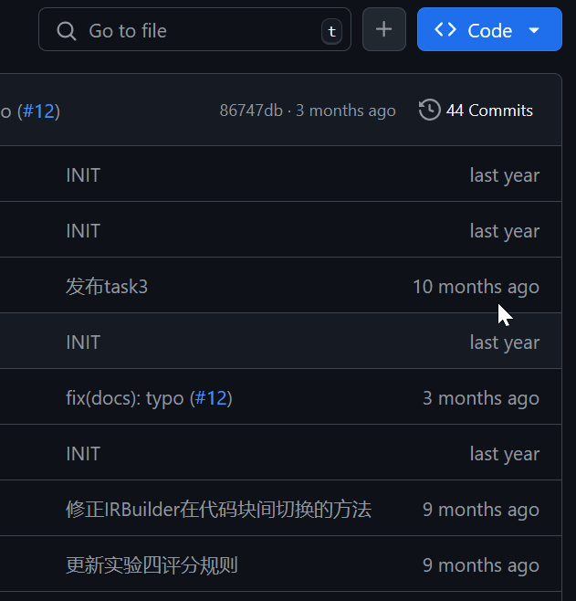

<!-- <p align="center">
  
</p> -->

# YatCC: Yat Compiler Course

中山大学（Sun **Yat**-sen University）[编译原理](https://arcsysu.github.io/teach/dcs290/s2024.html)课程实验

- 端到端的现代化开发体验：与 CMake 和 VSCode 深度结合，覆盖编码、构建、调试、评测、提交的完整开发环境和解决方案；
- 提供全自动的环境搭建脚本和“一键式”的标准化开发容器，以最速方式打开编码工作面，克服“万事开头难”；
- 预置完整、规范、采用最佳实践的基础示例代码和项目组织结构，大大降低了学生的上手难度，减少了与课程内容无关的工程量；
- 自定义配置机制允许学生根据自身情况和偏好选择完成实验的方式，增强了实验的灵活性；
- 根据示例代码撰写的“手把手式”的实验文档言之有物，提供了更加具体和清晰的实验指导。

# 内容

本实验共由 5 个任务组成：

- [任务 0：环境准备](task/0)
- [任务 1：词法分析](task/1)
- [任务 2：语法分析](task/2)
- [任务 3：中间代码生成](task/3)
- [任务 4：中间代码优化](task/4)

> 到任务各自的目录中查看具体的任务要求。

> （同时面向同学们和实验项目的维护人员）**为了建立对实验框架的整体认知，请阅读[《实验设计手册》](/docs/gyh-manual)。**

# 准备

## 使用 GitHub Codespaces

如果你可以使用 GitHub Codespaces，这会是开始实验的最快方式：



## 在自己的计算机上使用开发容器

你可以在自己的计算机上使用和 GitHub Codespaces 相同的开发容器镜像，[这篇文章](https://arcsysu.github.io/YatCC/#/introduction/environment)介绍了如何拉取并使用它。

## 手动搭建开发环境

如果你不想使用容器而是想直接在自己的 Linux 系统中使用本框架，请使用以下 bash 命令：

```bash
# 安装依赖（以 Ubuntu 24.04 为例）
sudo apt-get update
sudo apt-get install -y build-essential git python3 cmake ninja-build default-jdk bison flex unzip lld
# 克隆仓库
git clone https://github.com/arcsysu/YatCC.git -b main --single-branch --depth 1
# 进入仓库
cd YatCC
# 准备 ANTLR 与 LLVM
./antlr/setup.sh
./llvm/setup.sh
```

然后，使用 VSCode 打开仓库文件夹，即可开始实验。实验所需的 VSCode 插件已经全部列在 [`.vscode/extensions.json`](.vscode/extensions.json) 中，在打开文件夹时，VSCode 会自动提示你安装这些插件，你只需遵照提示点击安装即可。

> 如果不小心错过了这个提示，你总可以在 VSCode 侧边栏的插件面板中搜索 `@recommended` 看到所有推荐的插件。

# 配置

注意仓库根目录下的 `config.cmake` 文件，这是一个自定义配置文件，你可以根据自己的情况和偏好修改它。至少，你需要在其中填入你的姓名和学号。

通过这个文件，你可以选择实验一和实验二的完成方式：是使用 Bison+Flex 还是 ANTLR，相应地，你的程序也会在我们评测时使用相应的方式运行。

除此之外，你还可以通过它配置第一个之后的每个实验是否“复活”。所谓“复活”，是指将程序的输入由源代码的内容改为前一个实验的标准答案。由于本实验是线性、渐进的，如果你在前一个实验中“挂了”或是做得不够好，那么就可以选择“复活”来同步进度，从而继续后面的实验。

> 复活机制默认关闭

# 开始

现在，你已经准备好了，请按照每个任务的具体要求，开始你的编译器实验之旅吧！

你可以在这里找到更多的参考文档：[arcsysu.github.io/YatCC/](https://arcsysu.github.io/YatCC/)。
